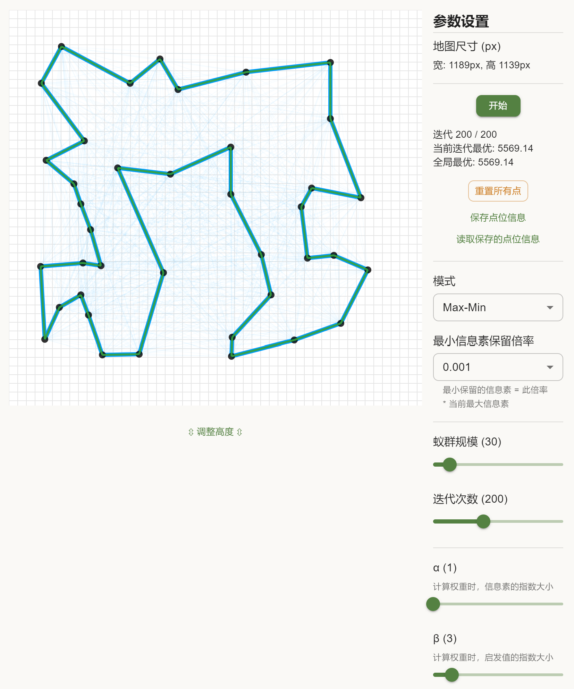

蚁群优化算法 与 旅行商问题 可视化演示
---

### Live Demo

[Demo 地址](http://aco-tsp.dev.mxowl.com/)



### 一些说明

程序的几个核心对象暴露在了```window.__DEBUG_CONTROLLERS```上，以便修改和查看一些界面上没有直接提供的变量。

例：
* 获取城市点位列表: ```window.__DEBUG_CONTROLLERS.ac.graph.cities```
* 获取边列表: ```window.__DEBUG_CONTROLLERS.ac.graph.edges```
* 修改自动执行时，蚂蚁的过渡动画的帧数 (1 帧时长为 16.6 ms)：```window.__DEBUG_CONTROLLERS.acoArtist.antAnimationFrames = 20```

### 参考

此程序很大程度上参考了来自 [TheProjectSpot](https://www.theprojectspot.com/home) 的 [这篇博客](https://www.theprojectspot.com/tutorial-post/ant-colony-optimization-for-hackers/10) 及其演示程序的实现。非常感谢原作者专业的分享。

### License

MIT.